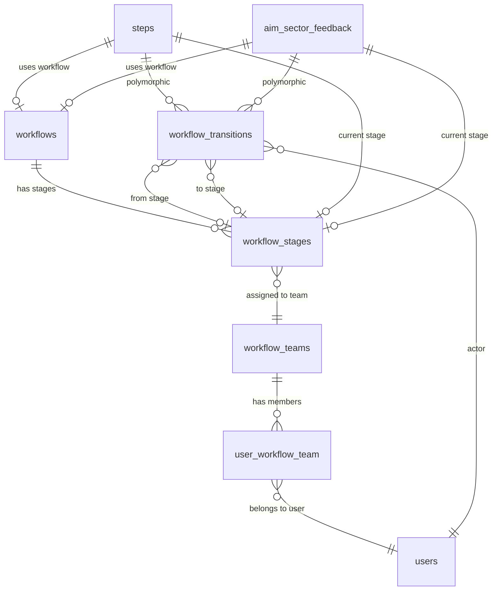

# Workflow System Architecture

## Overview

The Ehkam workflow engine is a **polymorphic, reusable system** that enables any model (`Step`, `AimSectorFeedback`, or future models) to participate in approval workflows. The system tracks items as they move through defined stages, with full audit logging of all transitions.

---

## Core Concepts

### 1. **Polymorphic Design**
Instead of being tied to a single model, the workflow system uses Laravel's polymorphic relationships to work with any model that implements the `HasWorkflow` interface.

### 2. **Workflow Definitions**
A **workflow** is a template that defines:
- The sequence of stages an item must pass through
- Which teams are responsible at each stage
- What actions are allowed (approve, return, reject)

### 3. **Stages**
**Workflow stages** are the checkpoints in a workflow, ordered by gapped integers (10, 20, 30...) to allow insertion of new stages without reindexing.

### 4. **Teams**
**Workflow teams** are groups of users who can act on items at specific stages.

### 5. **Transitions**
Every movement through the workflow is recorded as a **transition** for complete audit tracking.

---

## Database Schema



### Key Tables

#### `workflows`
| Column | Type | Description |
|--------|------|-------------|
| id | bigint | Primary key |
| name | string | Workflow name (e.g., "Project Approval Workflow") |
| description | text | Optional description |
| is_active | boolean | Whether workflow is active |

#### `workflow_stages`
| Column | Type | Description |
|--------|------|-------------|
| id | bigint | Primary key |
| workflow_id | bigint | FK to workflows |
| team_id | bigint | FK to workflow_teams |
| order | integer | Stage order (gapped: 10, 20, 30...) |
| name | string | Stage name (e.g., "Draft", "Review") |
| can_approve | boolean | Whether approval is allowed |
| can_return | boolean | Whether returning is allowed |
| assignment_type | enum | 'team', 'user', or 'role' |
| meta | json | Additional metadata |

#### `workflow_teams`
| Column | Type | Description |
|--------|------|-------------|
| id | bigint | Primary key |
| name | string | Team name (e.g., "Planning Team") |
| description | text | Optional description |

#### `workflow_transitions` **(Polymorphic)**
| Column | Type | Description |
|--------|------|-------------|
| id | bigint | Primary key |
| **workflowable_type** | string | Model class (e.g., 'App\\Models\\Step') |
| **workflowable_id** | bigint | Model ID |
| actor_id | bigint | FK to users (who performed action) |
| from_stage_id | bigint | FK to workflow_stages (previous stage) |
| to_stage_id | bigint | FK to workflow_stages (new stage) |
| action | enum | 'submit', 'approve', 'return', 'reject' |
| comments | text | Optional comments |
| created_at | timestamp | When action occurred |

---

## Using Workflows on Models

### Step 1: Implement the `HasWorkflow` Interface

Any model that needs workflow functionality must implement the `HasWorkflow` interface:

```php
<?php

namespace App\Models;

use App\Contracts\HasWorkflow;
use App\Models\Workflow;
use App\Models\WorkflowStage;
use App\Models\WorkflowTransition;
use Illuminate\Database\Eloquent\Model;
use Illuminate\Database\Eloquent\Relations\BelongsTo;
use Illuminate\Database\Eloquent\Relations\MorphMany;

class YourModel extends Model implements HasWorkflow
{
    /**
     * Required workflow columns in your migration:
     * - workflow_id (nullable FK to workflows)
     * - current_stage_id (nullable FK to workflow_stages)
     * - status (enum: draft, in_progress, completed, returned, rejected)
     */

    /**
     * Get the workflow this model belongs to.
     */
    public function workflow(): BelongsTo
    {
        return $this->belongsTo(Workflow::class);
    }

    /**
     * Get the current workflow stage.
     */
    public function currentStage(): BelongsTo
    {
        return $this->belongsTo(WorkflowStage::class, 'current_stage_id');
    }

    /**
     * Get all workflow transitions for this model.
     * 
     * Transitions are ordered newest first for easy access to recent history.
     */
    public function transitions(): MorphMany
    {
        return $this->morphMany(WorkflowTransition::class, 'workflowable')
            ->orderBy('created_at', 'desc');
    }

    /**
     * Check if the model is currently in an active workflow.
     */
    public function isInWorkflow(): bool
    {
        return $this->workflow_id !== null && $this->current_stage_id !== null;
    }

    /**
     * Check if the model can receive workflow actions.
     */
    public function canBeActedUpon(): bool
    {
        return !$this->isTerminal() && $this->current_stage_id !== null;
    }

    /**
     * Check if the model is in a terminal state (completed or rejected).
     * 
     * Terminal models cannot receive further workflow actions.
     */
    public function isTerminal(): bool
    {
        return in_array($this->status, ['completed', 'rejected']);
    }

    /**
     * Check if the model is still in draft status.
     */
    public function isDraft(): bool
    {
        return $this->status === 'draft';
    }
}
```

> **Note**: The `HasWorkflow` interface is defined in `app/Contracts/HasWorkflow.php`. 
> See [Developer Guide](developer-guide.md) for more details on working with workflows.

### Step 2: Add Database Columns

Your model's migration needs these columns:

```php
$table->foreignId('workflow_id')->nullable()->constrained('workflows')->nullOnDelete();
$table->foreignId('current_stage_id')->nullable()->constrained('workflow_stages')->nullOnDelete();
$table->enum('status', ['draft', 'in_progress', 'completed', 'returned', 'rejected'])->default('draft');
```

---

## Using the WorkflowService

The `WorkflowService` provides methods to manage workflow transitions:

### Submit to Workflow
```php
use App\\Services\\WorkflowService;

$service = app(WorkflowService::class);
$step = Step::find(1);
$user = Auth::user();

// Assign workflow and submit
$service->assignWorkflow($step, $workflowId = 1, $user, $autoSubmit = true);

// Or submit separately
$service->submitStep($step, $user, $comments = 'Ready for review');
```

### Approve
```php
$service->approveStep($step, $user, $comments = 'Looks good');
```

### Return to Previous Stage
```php
// Return to previous stage
$service->returnStep($step, $user, $comments = 'Please fix issues');

// Return to specific stage
$service->returnStep($step, $user, $targetStageId = 10, $comments = 'Back to draft');
```

### Reject
```php
$service->rejectStep($step, $user, $comments = 'Does not meet requirements');
```

---

## Example: Setting Up a Workflow

### 1. Create Teams
```php
$planningTeam = WorkflowTeam::create([
    'name' => 'Planning Team',
    'description' => 'Responsible for planning activities'
]);

$reviewTeam = WorkflowTeam::create([
    'name' => 'Review Team',
    'description' => 'Reviews submitted work'
]);

// Add users to teams
$planningTeam->users()->attach([1, 2, 3]);
$reviewTeam->users()->attach([4, 5]);
```

### 2. Create Workflow Definition
```php
$workflow = Workflow::create([
    'name' => 'Project Approval Workflow',
    'description' => 'Standard workflow for project approvals',
    'is_active' => true
]);
```

### 3. Create Workflow Stages
```php
WorkflowStage::create([
    'workflow_id' => $workflow->id,
    'team_id' => $planningTeam->id,
    'order' => 10,
    'name' => 'Draft',
    'can_approve' => true,
    'can_return' => false,
    'assignment_type' => 'team'
]);

WorkflowStage::create([
    'workflow_id' => $workflow->id,
    'team_id' => $reviewTeam->id,
    'order' => 20,
    'name' => 'Review',
    'can_approve' => true,
    'can_return' => true,
    'assignment_type' => 'team'
]);
```

### 4. Assign and Use
```php
$step = Step::find(1);
$user = User::find(1);

// Assign workflow
$step->update(['workflow_id' => $workflow->id]);

// Submit to first stage
app(WorkflowService::class)->submitStep($step, $user);
```

---

## Querying Workflow Data

### Get Pending Items for aUser
```php
$user = Auth::user();
$pending = $user->pendingWorkflowSteps(); // Returns Steps
```

### Get All Transitions for an Item
```php
$step = Step::with('transitions.actor', 'transitions.fromStage', 'transitions.toStage')->find(1);

foreach ($step->transitions as $transition) {
    echo "{$transition->actor->name} {$transition->action_label} ";
    echo "from {$transition->fromStage?->name} to {$transition->toStage?->name}";
}
```

### Get Items at Specific Stage
```php
$steps = Step::where('current_stage_id', $stageId)->get();
```

---

## Permissions

The workflow system checks that:
1. The user is a member of the team assigned to the current stage
2. The stage allows the requested action (can_approve, can_return)
3. The item is not in a terminal state (completed/rejected)

Access control is enforced in `WorkflowService::verifyUserCanAct()`.

---

## Best Practices

1. **Use Gapped Ordering**: Always use gapped integers (10, 20, 30...) for stage order to allow inserting stages later
2. **Implement Events**: The system fires events (`StepSubmitted`, `StepApproved`, etc.) - use them for notifications
3. **Audit Trail**: Never delete transitions - they provide full audit history
4. **Terminal States**: Once an item reaches `completed` or `rejected` status, it cannot be modified
5. **Team Membership**: Always ensure users are assigned to workflow teams before expecting them to act on items

---

## Summary

The polymorphic workflow system provides:
- ✅ Reusable across multiple models
- ✅ Full audit trail of all transitions
- ✅ Flexible stage ordering
- ✅ Team-based access control
- ✅ Event-driven notifications
- ✅ Type-safe through interface contracts

Any model can participate by implementing `HasWorkflow` and adding three database columns.

---

## Related Documentation

- **[Developer Guide](developer-guide.md)** - Service class documentation and usage examples
- **[Appointments System](appointments.md)** - Example of a system built on the workflow engine
- **[Documentation Index](README.md)** - Complete documentation overview

---

**Last Updated**: January 2026  
**Version**: 1.0.0
