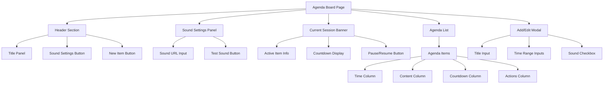

# Agenda Board Enhancement Plan

## Overview
Enhance the workshop agenda board at `/workshop/agenda_board` with Arabic UI, corrected sound path, stop/start countdown controls, and title editing panel.

## Current Issues
- **Sound Path**: Currently set to `/public/assets/sounds/notification1.mp3` (incorrect) - should be `/assets/sounds/notification1.mp3`
- **Language**: English only - needs Arabic UI with RTL support
- **Missing Features**: No countdown timer controls, no title editing panel

---

## Implementation Plan

### Phase 1: Arabic UI Conversion
1. Change `<html lang="en">` to `<html lang="ar" dir="rtl">`
2. Translate all UI text to Arabic:
   - "Agenda Board" → "لوحة جدول الأعمال"
   - "Manage your meeting timeline with precision" → "إدارة جدول اجتماعاتك بدقة"
   - "Sound" → "الصوت"
   - "New Item" → "إضافة عنصر جديد"
   - "Currently Active" → "النشط حالياً"
   - "remaining" → "متبقي"
   - "ACTIVE" → "نشط"
   - "Completed" → "مكتمل"
   - "Upcoming" → "قادم"
   - "Edit" → "تعديل"
   - "Delete" → "حذف"
   - "Notification Sound URL" → "رابط صوت الإشعار"
   - "Test Sound" → "اختبار الصوت"
   - "No agenda items yet" → "لا توجد عناصر في جدول الأعمال بعد"
   - "Create your first item" → "إنشاء أول عنصر"
   - "Edit Agenda Item" → "تعديل عنصر جدول الأعمال"
   - "New Agenda Item" → "عنصر جدول أعمال جديد"
   - "Title" → "العنوان"
   - "Start Time" → "وقت البدء"
   - "End Time" → "وقت الانتهاء"
   - "Play notification sound when started" → "تشغيل صوت الإشعار عند البدء"
   - "Cancel" → "إلغاء"
   - "Save Item" → "حفظ العنصر"
   - "Delete this agenda item?" → "حذف هذا العنصر من جدول الأعمال؟"
   - "End time must be after start time" → "يجب أن يكون وقت الانتهاء بعد وقت البدء"

3. Ensure Tailwind CSS RTL support (tailwind handles RTL automatically with `dir="rtl"`)

### Phase 2: Correct Sound Path
1. Update line 225 in JavaScript:
   - From: `soundUrl: '/public/assets/sounds/notification1.mp3'`
   - To: `soundUrl: '/assets/sounds/notification1.mp3'`

### Phase 3: Add Stop/Start Countdown Controls
1. Add countdown state variable: `countdownPaused: false`
2. Add pause/resume button in the Current Session Banner:
   - Show "Pause" (إيقاف مؤقت) when countdown is running
   - Show "Resume" (استئناف) when countdown is paused
3. Modify the `checkNotifications()` method to respect pause state
4. Update countdown display to show paused indicator

### Phase 4: Add Title Editing Panel
1. Add title editing state: `titleEditing: false`, `boardTitle: 'لوحة جدول الأعمال'`
2. Add edit button next to the main title
3. Create inline title edit interface:
   - Click edit icon → transform to input field
   - Save button to confirm changes
   - Cancel button to discard changes
4. Update title display throughout the page to use `boardTitle` variable

---

## Mermaid Diagram: Component Structure

---

## Files to Modify
- [`resources/views/workshop/agenda_board.blade.php`](resources/views/workshop/agenda_board.blade.php) - Complete overhaul

---

## Testing Checklist
- [ ] Arabic text displays correctly (RTL direction)
- [ ] Sound file plays from correct path
- [ ] Pause button stops countdown
- [ ] Resume button continues countdown
- [ ] Title editing works correctly
- [ ] All existing functionality preserved
